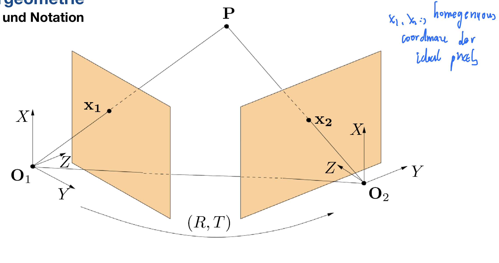

# CVEI

## Kapitel 1 Wissenswertes über Bilder

### 1.1 Darstellung von Bildern

#### 1.1.1 Vom Farbbild zum Intensitätsbild

Farbbilder bestehen aus 3 (mehreren) Kanälen

- **Kontinuierliche Darstellung** als Funktion zweier Veränderlicher 

$$
I : \mathbb R^2 \supset \Omega \rightarrow \mathbb R, \quad (x,y) \rightarrow I(x,y)
$$

​		$\Omega$ ist die Image. Wir nehmen an, dass I differenzierbar und $\Omega$ einfach zusammenhängend und beschränkt.

- **Diskrete Darstellung** als Matrix $I \in \mathbb R^{m \times n}$, Eintrag $I_{k,l}$ entspricht den Intensitätswert. Skalierung zwischen [0, 255] oder [0, 1]

Start von der kontinuierlicher Darstellung, wir können die kontinuierliche Funktionen abtasten in gewünscchte Resolution.

**Annahme: Ursprung links oben**, nach unten: y Axis und nach recht : x Axis

### 1.2 Bildgradient

Kanten sind starke lokale Änderungen der Intensität.

Lokale Änderung wird durch Gradienten beschrieben.  $\nabla I = \left[ \begin{matrix}   \frac{d}{dx}I(x,y) \\   \frac{d}{dy}I(x,y) \end{matrix}  \right]$

#### 1.2.2 Schätzung der Gradienten

Gegeben: Bild in diskreter Form $I \in \mathbb R^{m \times n}$.

- 1 . Naiver Ansatz:
  $$
  \frac{d}{dx}I(x,y) \approx I(x + 1, y) - I(x,y) \\
  \frac{d}{dy}I(x,y) \approx I(x , y + 1) - I(x,y)
  $$
  Nachteil: Nur direct benachbar Pixel betrachten werden. Falls das Bild Gerausch enthältet, treten es Problem.

- Zuerst wird das Image in continuierliche Funktion interpoliert und dann wird diese continuierliche Funktion abgeleitet.

​		Vom diskreten Signal $f[x] = S \left\{f(x) \right\}$ zum kontinuierlichen Signal $f(x)$

​		Interpoliertes Signal ist Faltung der Abtastwerte mit Interpolationsfilter $h(x)$
$$
f(x) \approx \sum_{k = - \infty}^{\infty}f[k]h(x - k) =: f[x]*h(x)
$$

>  2 types of Interpolotionsfilter:
>
> - Gaußfilter:   $h(x) = g (x)$, $g(x) = C e^{\frac{-x^2}{2 \sigma ^2}}$ , die Interpolation in Stelle k wurde durch benachbare Funktion einflusst, z.B die Distribution und sigma. 
> - Ideales Interpolationsfilter: $h(x) = sinc(x)$, $sinc(x) = \frac{sin(\pi x)}{\pi x}, \quad sinc(0) = 1$  , unabhängig von benachbarer Funktion

​	

**Ableitung**:
$$
\begin{align}
f'(x) &\approx \frac{d}{dx} (f[x] * h(x)) \\
&= f[x] * h'(x)
\end{align}
$$
f[x] is constant
$$
\begin{align}
f'[x] &= f[x]*h'[x] \\
&= \sum_{k = - \infty}^{\infty}f[x - k]h'[k]
\end{align}
$$

- Gradient von Sinc-Funktion: Langsames Abklingen, $\frac{d}{dx}sinc(x)$ 
- Gradient von Gaußfilter: schnelles Abklingen, $\frac{d}{dx}g(x)$   ====> ==besser==

**Abtastung**

2D - Rekonstruktion $I(x,y) \approx I[x,y] * h(x,y) = \sum_{k = - \infty}^{\infty} \sum_{l = - \infty}^{\infty} I[k,l]g(x-k)g(y-l)$ 

Ableitung in x-Richtung
$$
\begin{align}
\frac{d}{dx}I(x,y) &\approx I[x,y] * (\frac{d}{dx}h(x,y)) \\
& = \sum_{k = - \infty}^{\infty} \sum_{l = - \infty}^{\infty}I[k,l] g'(x - k)g(y-l)
\end{align}
$$
Abtastung von dx:
$$
\begin{align}
S\left\{ \frac{d}{dx}I(x,y)\right\} &= I[x,y]*g'[x]*g[y]\\
&=  \sum_{k = - \infty}^{\infty} \sum_{l = - \infty}^{\infty}I[x-k,y-l] g'[k]g[l]
\end{align}
$$

Ableitung in y -Richtung
$$
\begin{align}
\frac{d}{dy}I(x,y) &\approx I[x,y] * (\frac{d}{dy}h(x,y)) \\
& = \sum_{k = - \infty}^{\infty} \sum_{l = - \infty}^{\infty}I[k,j] g(x - k)g'(y-l)
\end{align}
$$

 Abtastung von dy:
$$
\begin{align}
S\left\{\frac{d}{dy}I(x,y)\right\} &\approx I[x,y] * g[x]*g'[y] \\
& = \sum_{k = - \infty}^{\infty} \sum_{l = - \infty}^{\infty}I[x-k,y-l] g[k]g'[l]
\end{align}
$$

#### 1.2.3 Endliche Approximation des Gaußfilters

Interpoliertes Signal: $f(x) \approx \sum_{k=- \infty}^{\infty}f[k]g(x-k)$

Abgetastetes interpoliertes Signal $f[x] \approx \sum_{k = -\infty}^{\infty}f[x-k]g[k]$

Approximation durch endliche Summe:
$$
f[x] \approx \sum_{k = -n}^{n}f[x-k]g[k]
$$
Die endliche Approximation von $f[x]$ ist eine gewichtete Summe der Werte $f[x-n]...f[x+n]$ mit Gewicht $g[n], ... g[-n]$

$g[k] = c e^{\frac{-k^2}{2 \sigma ^2}}$

Normierungskonstant C so gewählt, dass sich alle Gewichte (g[n] ... g[-n]) zu 1 addieren.
$$
C = \frac{1}{\sum_{-n \leq k \leq n}e^{\frac{-k^2}{2 \sigma^2}}}
$$
so:
$$
\begin{align}
S\left\{\frac{d}{dx}I(x,y)\right\} &\approx I[x,y] * g'[x]*g[y] \\
& = \sum_{k = - \infty}^{\infty} \sum_{l = - \infty}^{\infty}I[x-k,y-j] g'[k]g[l] \\
& \approx \sum_{k = - n}^{n} \sum_{l = - n}^{n}I[x-k,y-l] g'[k]g[l] \\
& =  \sum_{k = -1, 0, 1} \sum_{l = -1, 0, 1}I[x-k,y-l] g'[k]g[l] 
\end{align}
$$
Nur -1, 0, 1
$$
\begin{align}
S\left\{\frac{d}{dy}I(x,y)\right\} &\approx I[x,y] * g[x]*g'[y] \\
& = \sum_{k = - \infty}^{\infty} \sum_{l = - \infty}^{\infty}I[x-k,y-j] g[k]g'[l] \\
& \approx \sum_{k = - n}^{n} \sum_{l = - n}^{n}I[x-k,y-l] g[k]g'[l] \\
& = \sum_{k = -1, 0, 1}\sum_{l = -1, 0, 1}I[x-k,y-l] g[k]g'[l] \\
\end{align}
$$
Daraus folgt:$C = \frac{1}{1 + 2e^{-\frac{1}{2\sigma^2}}}$

#### 1.2.4 Sobel Filter

Aus praktischen Gründen sind ganzzahlige Filterkoeffizienten erwünscht.

Falls $\sigma = \sqrt{\frac{1}{2 \log 2}}$ ergibt sich somit:
$$
g[-1] = \frac{1}{4}, g[0] = \frac{1}{2}, g[1] = \frac{1}{4} \\
g'[-1] = \frac{1}{2} \log 2, g[0] = 0,  g'[1] = -\frac{1}{2} \log 2 
$$
g[k]'g[l] =  $\frac{1}{8} \log 2 \left[
 \begin{matrix} 
 1 & 0 & -1 \\  2 & 0 & -2 \\ 1 & 0 & -1 
 \end{matrix}  \right]$

Horizontales Sobel-Filter:
$$
\left[
 \begin{matrix} 
 1 & 0 & -1 \\  2 & 0 & -2 \\ 1 & 0 & -1 
 \end{matrix}  \right]
$$
Vertikales Sobel-Filter:
$$
\left[
 \begin{matrix} 
 1 & 2 & 1 \\  0 & 0 & 0 \\ -1 & -2 & -1 
 \end{matrix}  \right]
$$

### 1.3 Merkmalspunkte- Ecken und Kanten

#### 1.3.1 Harris Ecken- und Kantendetektor

Änderung des Bildsegments in Abhängigkeit der Verschiebung

Für ein Kleines Fenster W verschiebt in Richtungsvector u:

- Ecke: Verschiebung in jede Richtung bewirkt Änderung
- Kante: Verschiebung in jede bis auf genau eine Richtung bewirkt Änderung (nur eine Richung keine Änderung)
- Homogene Fläche: Keine Änderung, egal in welche Richtung

Position in Bild: $x = \left[
 \begin{matrix} 
 x_1 \\  x_2  
 \end{matrix}  \right]$, $I(x) = I(x_1, x_2)$

Verschiebungsrichtung:  $u = \left[
 \begin{matrix} 
 u_1 \\  u_2  
 \end{matrix}  \right]$

Änderung des Bildsegments:
$$
S(u) = \int_W (I(x + u) - I(x))^2dx
$$
Differenzierbarkeit von I:
$$
\lim_{u \rightarrow 0} \frac{I(x+u) - I(x) - \nabla I(x)^T u}{||u||} = 0 \\
\Rightarrow I(x+ u) - I(x) = \nabla I(x)^T u + o(||u||) 
$$
Approximation für kleine Verschiebung:
$$
\begin{align}
I(x + u) - I(x) \approx \nabla I(x)^Tu \\
\Rightarrow S(u) &= \int_W (I(x )^Tu)^2dx \\
&= u^T (\int_W \nabla I(x) \nabla I(x)^T dx) u
\end{align}
$$
Harris-Matrix:
$$
G(x) = \int_W \nabla I(x) \nabla I(x)^T dx \\
\nabla I(x) \nabla I(x)^T  = \left[ \begin{matrix}  (\frac{\partial}{\partial x_1}I(x))^2 & \frac{\partial}{\partial x_1}I(x) \frac{\partial}{\partial x_2}I(x)   \\  \frac{\partial}{\partial x_2}I(x) \frac{\partial}{\partial x_1}I(x)  & (\frac{\partial}{\partial x_2}I(x))^2  \end{matrix}  \right] \\
\\
S(u) = u^T G(x)u
$$
if for all u , s(u) > 0, dann eine Ecke 

if for ein u gilt s(u) = 0, andere s(u) > 0 dann eine Kante

Wenn für all u, s(u) = 0, dann homogeneous Fläche

$G(x)$ ist postiv semi-definit

#### 1.3.2 Eigenwertzerlegung von Harris Matrix

Eigenwertzerlegung der Harris Matrix:
$$
G(x) = \int_W \nabla I(x) \nabla I(x)^T dx  = V \left[ \begin{matrix}  \lambda_1 &   \\  & \lambda_2  \end{matrix}  \right]V^T
$$
mit $VV^T = I_2$ und den Eigenwerten $\lambda_1 \geq \lambda_2 \geq 0$

Änderung in Abhängigkeit der Eigenvektoren $V = [v_1, v_2]$
$$
S(u) \approx u^TG(x)u = \lambda_1(u^Tv_1)^2 + \lambda_2(u^Tv_2)^2
$$

>- Beide Eigenwerte positiv 
>
>  -  S(u) > 0 für alle u (Änderung in jede Richtung)
>  - Untersuchtes Bildsegment enthält eine Ecke
>
>- Ein Eigenwert positiv, ein Eigenwert gleich null
>
>  - $ S(u) = \left\{ \begin{aligned} &= 0 \quad falls \quad u = rv_2 \\ &> 0 \end{aligned} \right.$ 
>
>    keine  Änderung nur in Richtung des Eigenvektors zum Eigenwert 0
>
>  - Untersuchtes Bildsegment enthält eine Kante
>
>- Beide Eigenwerte gleich null
>
>  - S(u) = 0 für alle  u , keine Änderung, egal in welche Richtung
>  - Untersuchtes Bildsegment ist eine homogene Fläche

Approximiere G(x) durch endliche Summe
$$
G(x) = \int_W \nabla I(x) \nabla I(x)^T dx \approx \sum_{\widetilde x \in W(x)} \nabla I(\widetilde x) \nabla I(\widetilde x)^T
$$
Gewichtete Summe in Abhängigkeit der Position von $\widetilde x$ 
$$
G(x) \approx \sum_{\widetilde x \in W(x)}w(\widetilde x) \nabla I(\widetilde x) \nabla I(\widetilde x)^T
$$
Gewichte $w(\widetilde x) > 0$ betonen Einfluss der zentralen Pixel

In der Realität nehmen Eigenwerte nie genau den Wert null an, z.B. auf Grund von Rauschen, diskreter Abtastung und numerischen Ungenauigkeiten.

Charakteristik in der Praxis:

- Ecke: zwei große Eigenwerte
- Kante: ein großer Eigenwerte, ein kleiner Eigenwert
- Homogene Fläche: zwei kleine EigenwerteuntimeError: a leaf Variable that requires grad is being used in an in-place operation.

> Zusammenhang von Eigenwerten, Determinante und Spur einer Matrix:
>
> Seien $\lambda_1, ... \lambda_n$ Eigenwerte einer Matrix G
>
> Dann gilt:
>
> - $det G = \prod_{i= 1}^{n} \lambda_i$ Determinante ist das Produkt der Eigenwerte
> - $tr G = \sum_{i= 1}^{n} \lambda_i$ Spur ist die Summe der Eigenwerte

#### 1.3.3 Ein einfaches Kriterium für Ecken und Kante

- Betrachte die Größe $H: = det(G) - k(tr(G))^2$ 

$$
H = (1- 2k) \lambda_1 \lambda_2 - k(\lambda_1^2 + \lambda_2^2)
$$

- Ecke (beide Eigenwerte groß)

  - H größer als ein positiver Schwellwert: $0 <\tau_+<H$

- Kante (ein Eigenwert groß, ein Eigenwert klein)

  - H kleiner als ein negativer Schwellwert $H < \tau_- < 0$

- Homogene Fläche (beide Eigenwerte klein)

  - H betragsmäßig klein $ \tau_-< H < \tau_+$

  

### 1.4 Korrespondenzschätzung für Merkmalspunkte

Gegeben sind zwei Bilder: $I_1: \Omega_1 \rightarrow \mathbb R$, $I_2: \Omega_2 \rightarrow \mathbb R$ derselben 3D-Szene

Finde Paare von Bildpunkten $(x^{(i)}, y^{(i)}) \in \Omega_1 \times \Omega_2$, die zu gleichen 3D-Punkten korrespondieren.

- In dieser Session: Korrespondzen für Merkmalspunkte in $I_1$ und $I_2$
- Habe Merkmalspunkte $\left\{x_1, .. x_n\right\} \sub \Omega_1$ und $\left\{y_1, .. y_n\right\} \sub \Omega_2$
- Finde passende Paare von Merkmalspunkten $\left\{ V_i, W_j\right\}$

#### 1.4.1 Näive Ansätze

 Intensität in verschiedene Stelle betrachten mit Sum of squared differences (SSD).

- Wir haben nur 256 unterschiedliche Intensitätswerte. Es gibt viele unterschiedliche Pixels im Bild gleiche Intensität haben
- Unterschiedliche Beleuchtungsbedingung für die korrespondenzend Punkte

**Betrachte Bildausschnitte $V_i$ um $x_i$ und $W_i$ um $y_i$ in Matrixdarstellung und vergleiche den Intensitäten**

Ein Kriterium: $d(V, W) = ||V- W||^2_{F}$ 

Dabei ist $||A||^2_F = \sum_{kl}A^2_{kl}$ die quadrierte Frobeniusnorm
$$
||A||_F^2 = \sum_{i, j} a_{i,j}^2, \quad \forall a_{i,j} \in A
$$
So die summe der 

Finde zu $V_i$ das $W_j$ mit $j = \arg \min_{k=1, ..., n} d(V_i, W_k)$

Annahme wenn $W_j$ zu $V_i$ passt, dann auch umgekehrt.

**Schwachpunkte der SSD-Methode**

- Änderung der Beleuchtung oder Drehungen --- Normierung von Intensität und Orientierung benötigt.

  - Die Rotation kann mittels Gradientenrichtung normiert, die Rotationswinkel kann durch Gradientsrichtung  der korrespondiert Punkte bestimmt.

    - 1. Bestimme Gradienten in allen Merkmalspunkten
      2. Rotiere Regionen um Merkmalspunkte so, dass Gradient in eine Richtung zeigt.
      3. Extrahiere $V, W$ aus rotierten Regionen

      ==Bias und Gain modell==

  - Modellierung von Kontrast und Hellligkeit

    - Skalierung der Intensitätswerte (Gain) mit $\alpha$, bewirkt **Kontraständerung**
    - untimeError: a leaf Variable that requires grad is being used in an in-place operation.Verschiebung der Intensitätswerte (Bias) mit $\beta$ , bewirkt **Helligkeitsänderung**

    Gain Modell: $W \approx \alpha V$

    Bias Modell: $W \approx V + \beta \mathbb 1 \mathbb 1^T$ 
    $$
    \mathbb 1 = (1, ... , 1)^T, \\
    \mathbb 1 \mathbb 1^T = ones()
    $$
    Bias und Gain Modell $W \approx \alpha V + \beta \mathbb 1 \mathbb 1^T$

    > for a matrix A Mittelwert $= \mathbb 1^T A \mathbb 1 $
    >
    > Mittelwertsmatrix $\bar A = \frac{1}{N}\mathbb 1 \mathbb 1^T A \mathbb 1 \mathbb 1^T$

    

  - Berechnung des Mittelwertes
    $$
    \begin{align}
    \bar W &= \frac{1}{N}(\mathbb 1 \mathbb 1^T W \mathbb 1 \mathbb 1^T)\\
    & \approx \frac{1}{N}(\mathbb 1 \mathbb 1^T (\alpha V + \beta \mathbb 1 \mathbb 1^T)\mathbb 1 \mathbb 1^T) \\
    & = \alpha \frac{1}{N}(\mathbb 1 \mathbb 1^T V \mathbb 1 \mathbb 1^T ) + \beta \mathbb 1 \mathbb 1^T
    & = a \bar V + \beta \mathbb 1 \mathbb 1^T
    \end{align}
    $$
    Subtraktion der Mittelwertmatrix
    $$
    W - \bar W \approx \alpha V + \beta \mathbb 1 \mathbb 1^T -  a \bar V - \beta \mathbb 1 \mathbb 1^T = \alpha(V - \bar V)
    $$

  - Berechnung der Standardabweichung
    $$
    \begin{align}
    \sigma(W) &= \sqrt{\frac{1}{N -1}||W - \bar W||^2_F}\\
    & = \sqrt{\frac{1}{N -1} tr ((W - \bar W)^T(W - \bar W))} \\
    & \approx \sqrt{\frac{1}{N -1} tr (\alpha(V - \bar V)^T\alpha(V - \bar V))} \\
    & = \alpha \sigma(V)
    \end{align}
    $$

  - Zusammenfassend:

    Normalisierung der Bildsegmente durch

    1. Subtraktion des Mittelwertes
    2. Division durch Standardabweichung

    $$
    \begin{align}
    W_n &= \frac{1}{\sigma(W)}(W - \bar W)\\
    & \approx \frac{1}{\alpha \sigma(V)} (\alpha (V - \bar V)) \\
    &= \frac{1}{\alpha \sigma(V)} (V - \bar V) \\
    &=: V(n)
    \end{align}
    $$

    

#### 1.4.2 Normalized Cross Correlation (NCC)

SSD von zwei normalisierten Bildsegmenten:
$$
||V_n - W_n||^2_F = 2(N - 1)- 2tr(W_n^TV_n)
$$

$$
\Rightarrow V_n = \frac{V - \bar V}{\sqrt{\frac{1}{N -1}||V - \bar V||^2_F}} \\
tr(V^T_nV_n) = \frac{||V - \bar V||^2}{\frac{1}{N-1}||V - \bar V||^2_F} = N-1
$$

Die normalized Cross Correlation der beiden Bildsegmente ist definiert als $\frac{1}{N-1}tr(W_n^TV_n)$

Es gilt $-1 < NCC < 1$

Zwei normalisierte Bildsegmente sind sich ähnlich, wenn:

- SSD klein (wenig Unterschiede)
- NCC nahe bei +1 (hohe Korrelation)

## Kapitel2 Bildentstehung

### 2.1 Das Lochkameramodell

#### 2.1.1 Abbildung durch eine dünne Linse

- Strahlen parallel zur optischen Achse werden so gebrochen, dass sie durch den Brennpunkt gehen
- Strahlen durch das optische Zentrum werden nicht abgelenkt

Koordinaten von P bzgl. optischem Zentrum der Kamera seien Karame seien $(X, Y, Z)$

Dann sind die Koordinaten des Bildpunktes $(-\frac{fX}{Z}, -\frac{fY}{Z}, -f)$

Für Vereinfachung wir nehmen an, dass Bild vor optischen Zentrum liegt $(\frac{fX}{Z}, \frac{fY}{Z}, f)$

Alle Punkte auf einer Geraden durch das optische Zentrum werden auf denselben Bildpunkte abgeleitet, umgekehrt exisiert zu jedem Bildpunkt genau eine Gerade.

Idealisierte Abnahme der Lochkamera:

- Dünne Linse

- Kleine Blende

- Beliebig großer Blickwinkel

- Perspektivische Projektion : die Abbildung der Koordinaten des 3D Punktes auf die 2D Koordinaten in der Brennebene
  $$
  \pi: \mathbb R^3 \left\{(X,Y) -Ebene\right\} \rightarrow \mathbb R^2, \left[
   \begin{matrix} 
   X  \\  Y \\ Z 
   \end{matrix}  \right] \rightarrow \frac{f}{Z}\left[
   \begin{matrix} 
   X  \\  Y 
   \end{matrix}  \right]
  $$

### 2.2 Homogene Koordinaten

#### 2.2.1 Der projektive Raum

Zwei Vektoren $x, y \in \mathbb R^n$ nennen wir zueinander äquivalent, fall ein scalar $\lambda \ne 0$ existiert mit $ x = \lambda y$, in diesem Fall $x \sim y$

Eine Gerade durch $x \ne 0$ (keine Original) können als **Äquivalenzklasse** beschrieben werden:
$$
[x] := \left\{ y \in \mathbb R ^n | y \sim x\right\}
$$
Die Menge aller Geraden im $\mathbb R^{n+1}$ heißt **projektiver Raum** (alle Geraden durch Original)
$$
\mathbb P_n = \left\{ [x]|x \in \mathbb R^{n + 1} / \left\{0 \right\}\right\}
$$

#### 2.2.2 Homogene Koordinaten

Normiert man die Längeneinheit auf die Brennweite, d.h, die Bildebene ergeben sich durch
$$
BE = \left\{ \left[
 \begin{matrix} 
 X  \\  Y \\ Z 
 \end{matrix}  \right] \in \mathbb R^3 | Z = 1\right\} |
$$
$\left[
 \begin{matrix} 
 X  \\  Y \\ Z 
 \end{matrix}  \right] $ heißt die **homogene Koordinaten** von $\left[
 \begin{matrix} 
 X  \\  Y
 \end{matrix}  \right] $

### 2.3 Euklidische Bewegungen

Beschreibung der Karamebewegung in Form von Koordinatenänderung eines fest Raumpunktes

#### 2.3.1 Allgemein

Die Matrizen $O(n):= \left\{O \in \mathbb R^{n \times n}| O^TO = I_n\right\}$ heißen orthogonal Matrix. 
$$
\det(I_n) = \det(O^TO) = det(O^T)det(O) = det(O)^2 \quad \Rightarrow det(O) = \pm 1
$$
Rotationen in $\mathbb R^n$ werden beschrieben durch die Spezielle orthogonal Matrizen:
$$
SO(n):= \left\{R \in \mathbb R^{n \times n}| R^TR=I_n, \det(R)= 1\right\}
$$
Euklidische Bewegung durch Koordinatenänderung:
$$
g_{R,T}: \mathbb R^n \rightarrow \mathbb R^n, \quad P \rightarrow RP + T
$$
 $P_1$ ist die Koodinaten eines Punktes bzgl. Camera Frame 1 und $P_2$ ist Koordinaten des ==selben== Punktes bzgl. des bewegten Camera Frame 2, dann ist $P_2 = RP_1 + T$

in homogenen Koordinaten:
$$
M= \left[
 \begin{matrix} 
 R & T  \\  0 & 1 
 \end{matrix}  \right] \Rightarrow P_2^{(hom)} = M P_1^{hom}
$$
Spezielle Euklidische Gruppe:
$$
SE(n) = \left\{M = \left[
 \begin{matrix} 
 R & T  \\  0 & 1 
 \end{matrix}  \right] | R \in SO(n), T \in \mathbb R ^n\right\} \sub \mathbb R^{(n + 1) \times (n+1) }
$$

#### 2.3.2 Eigenschaften

$$
M_1 M_2 =  \left[
 \begin{matrix} 
 R_1R_2 & R_1T_2 + T_1  \\  0 & 1 
 \end{matrix}  \right]  \in SE(n)
$$

Euklidische Bewegunen sind invertierbar.
$$
M^{-1} = \left[
 \begin{matrix} 
 R & T  \\  0 & 1 
 \end{matrix}  \right]^{-1} = \left[
 \begin{matrix} 
 R^T & -R^TT\\  0 & 1 
 \end{matrix}  \right]
$$

#### 2.3.3 Eigenschaften Orthogonal Transformation

1. Orthogonal Transformationen erhalten Skalarprodukt $<u ,v> = <Ou, Ov>$ (Winkel zwischen Vektoren bleibt  gleich)
   $$
   <Ou, Ov> = u^T O^T Ov = u^T v
   $$

2. Euklidische Transformation erhalten den Abstand (Abstand zwischen Vektoren bleibt gleich)
   $$
   ||g(R, T)u^{hom} - g(R,T)v^{hom}|| = ||Ru - Rv|| = ||R||.||u - v||= ||u - v||
   $$

3. Spezielle orthogonale Transformation erhalten den Kreuzprodukt

$$
Ru \times Rv  = R(u \times v)
$$

### 2.4 Perspektische Projektion mit kalibrierter Kamera

Perspektische Projektion in homogenen Koordinaten
$$
Z\left[
 \begin{matrix} 
 x   \\  y \\ 1 
 \end{matrix}  \right] = \left[
 \begin{matrix} 
 f & 0 & 0 &0   \\  0 & f & 0 &0  \\ 0 & 0 & f &0 
 \end{matrix}  \right] \left[
 \begin{matrix} 
 X   \\  Y \\ Z\\1 
 \end{matrix}  \right]
$$
Difinierte $K_f : = \left[
 \begin{matrix} 
 f & 0 & 0    \\  0 & f & 0  \\ 0 & 0 & f  
 \end{matrix}  \right] $, $\Pi_0 = \left[
 \begin{matrix} 
 1 & 0 & 0 &0   \\  0 & 1 & 0 &0  \\ 0 & 0 & 1 &0 
 \end{matrix}  \right]$

Die pekspektische Projektion ist somit (Z)
$$
x^{hom} \sim K_f \Pi_0P^{hom}
$$

Die perspektische Projektion mit euklidischer Transformation ist:
$$
x^{hom} \sim K_f \Pi_0 \left[
 \begin{matrix} 
 R & T  \\  0 & 1 
 \end{matrix}  \right]P_0^{hom}
$$

> https://www.twblogs.net/a/5b8b4a682b717718832e9793?lang=zh-cn

Transformation von Bildkoordinaten in Pixelkoordinaten

1. Spezifizieren der Längeneinheiten (LE), $s_x$ bedeutet wie länge die Seitenlänge eines Pixels representiert

   - $x_s = s_x x$, gleich mit $y_s = s_y y$
   - $s_x = s_y$ bedeutet quadratische Pixel

2. Justieren des Ursprungs

   - Pixelkoordinaten $x' = x_s + o_x$, gleiches mit $y' = y_s + o_y$

3. Einführen eines Scherungsfaktors $s_{\theta}$

   1. Die Koordinate kann nicht genau senkrecht sein

   $$
   K_s = \left[
    \begin{matrix} 
    s_x & s_{\theta} & o_x    \\  0 & s_y & o_y  \\ 0 & 0 & 1  
    \end{matrix}  \right] \\
    x' = K_sx \\
    \because x \sim K_s \Pi_0P \\
    \therefore x' \sim K_sK_f \Pi_0P =  \left[
    \begin{matrix} 
    s_x & s_{\theta} & o_x    \\  0 & s_y & o_y  \\ 0 & 0 & 1  
    \end{matrix}  \right]\left[
    \begin{matrix} 
    f & 0 & 0    \\  0 & f & 0  \\ 0 & 0 & f  
    \end{matrix}  \right]\left[
    \begin{matrix} 
    1 & 0 & 0 &0   \\  0 & 1 & 0 &0  \\ 0 & 0 & 1 &0 
    \end{matrix}  \right]\left[
    \begin{matrix} 
    X   \\  Y \\ Z \\ 1
    \end{matrix}  \right]
   $$
   
   

​			**Intrinsic Parameter K = ** $K_sK_f$ 

Umbrechnung von idealen Bildkoordinaten und Pixelkoordinaten:
$$
x' = K_s x \quad \quad x = K_s^{-1}x'
$$

### 2.5 Bild, Urbild und Cobild

Eine Gerade im Raum in homogenen Koordinaten: (**homo Koordinate ändert nicht**)
$$
L^{(hom)} = \left\{P_0^{hom} + \lambda\left[v_1, v_2,v_3, 0\right]^T | \lambda \in \mathbb R\right\}
$$
Perspektivische Projektion einer Geraden: 
$$
P_0^{(hom)} = \left[
 \begin{matrix} 
 1   \\   1  \\ 0 \\ 1 
 \end{matrix}  \right], \quad v = \left[
 \begin{matrix} 
 1   \\   -1  \\ 1 \\ 0 
 \end{matrix}  \right]\\
\therefore L^{(hom)} := \left[
 \begin{matrix} 
 1 + \lambda   \\   1 - \lambda  \\ \lambda \\ 1 
 \end{matrix}  \right] \Rightarrow \Pi_0L^{(hom)} = \left[
 \begin{matrix} 
 1 + \lambda   \\   1 - \lambda  \\ \lambda  
 \end{matrix}  \right] \sim \left[
 \begin{matrix} 
 \frac{1}{\lambda } +  1 \\    \frac{1}{\lambda } - 1  \\ 1
 \end{matrix}  \right]
$$

#### 2.5.1 Bild und Urbild

**Das Bild** eines Punktes bzw. einer Geraden ist deren Perspektivische Projektion $\Pi_0P^{(hom)}$ bzw. $\Pi_0L^{(hom)}$

**Das Urbild** eines Punktes P bzw. einer Geraden $L$ sind alle Punkte im Raum, die auf den gleichen Bildpunkt bzw. auf die gleiche Gerade in der Bildebene projiziert werden.
$$
Urbild(P) = \left\{Q \in \mathbb R^3 | \Pi_0Q^{hom} \sim \Pi_0P^{hom}\right\} \\
Urbild(L^{(hom)}) = \cup_{P \in L}Urbild(P)
$$

> 1. Urbild von Punkten sind Geraden durch Ursprung
> 2. Urbild von Geraden sind Ebene durch Ursprung

**Das Cobild** von Punkten oder Geraden ist das orthogonale Komplement des Urbildes

**Zusammenhänge**

|       | Bild                        | Urbild         | Cobild         |
| ----- | --------------------------- | -------------- | -------------- |
| Punkt | span(P) $\bigcap$ BE        | span(P)        | span($\hat P$) |
| Linie | span($\hat l$) $\bigcap$ BE | span($\hat l$) | span($l$)      |

Nützliche Eigenschaften von Cobild

- 1. Sei $L$ eine Gerade in Raum mit $\hat l \in Cobild(L)$ , und sei $x$ das Bildpunkt auf dieser Linie, dann gilt:

     $x^Tl = l^Tx = 0$

- 2. Seien $x_1, x_2$ Bilder zweier Punkte im Raum, dann gilt für das Cobild $l$ der Verbindungslinien:

     $l \sim x_1 \times x_2$

- 3. Seien $l_1, l_2$ die Cobilder zweier Geraden. Dann gilt für den Schnittpunkt $x$ dieser zweien Graden im BE :

     $x \sim l_1 \times l_2$

#### 2.5.2 Exkurs: Lineare Algebra

- Erzeugnis von Spaltenvektoren $a_i$ einer Matrix $A = [a_1, ... , a_m] \in \mathbb R^{n \times m}$ 
  $$
  span(A) = \left\{\sum_{i=1}^m\lambda_ia_i | \lambda_i \in \mathbb R\right\}
  $$
  Erzeugnis ist ein Untervektorraum von $\mathbb R^n$

- Orthogonal Komplement eines Untervektorraums:
  $$
  span(A)^{\perp} = {v \in \mathbb R^n | <a_i, v> = 0, i= 1...m}\quad \Rightarrow AV = 0
  $$

- Reelle symmetrische Matrizen sind diagonalisierbar und haben zueinander othogonal Eigenvektoren.
  $$
  \begin{align}
  A[v_1, ... v_n] &= [Av_1, ... Av_n]\\
  &=[\lambda_1v_1, ... \lambda_nv_n]\\
  &=[v_1,...,v_n]\left[
   \begin{matrix} 
   \lambda_1 &  &  &  \\ & \lambda_2 & & \\ & & .. & \\ & & & \lambda_n 
   \end{matrix}  \right]\\
   \Rightarrow D_A = \left[
   \begin{matrix} 
   \lambda_1 &  &  &  \\ & \lambda_2 & & \\ & & .. & \\ & & & \lambda_n 
   \end{matrix}  \right] = V^TAV
  \end{align}
  $$
  

#### 2.5.3 Kollinearität von Bildpunkten

Der Bildpunkte $x_1, ... x_n$ liegen genau auf einer Linie (Kollinear), wenn $Rang([x_1, ..x_n]) \le 2$ 

- Proof:

  Wenn kollinear ist, es gibt $l \in \mathbb R^3 | <0>$  so dass $x^Tl = l x^T = 0$, für alle Punkt $x_i$ 

  $l\in span([x_1, .. x_n])^{\perp} \quad \Rightarrow dim(span([x_1, ...x_n])^{\perp}) \ge 1 \Rightarrow Rang([x_1, .. x_n]) \le 2 \quad \therefore det(x_1,... x_n) = 0$  

Auch falls der kleinest Eigenwert von $M = \sum_{i=1}^{n}w_ix_ix_i^T$ gleich null ist, $\forall w_i > 0$, sind die Bildpunkte $x_1, ... x_n$ genau kollinear.

- Proof:

  Kollinear, es existiert ein $l \in \mathbb R ^n /<0>$ so dass $x_i^Tl = 0 \Rightarrow \sum_{i=1}^{n}l^Tx_ix_i^Tl = 0$
  $$
  \begin{align}
  \therefore 
  
  \sum_{i=1}^{n}w_il^Tx_ix_i^Tl = 0\\
  l^T (\sum_{i=1}^{n}w_ix_ix_i^T)l = 0
  
  \end{align}
  $$
  ​    

  $M = \sum_{i=1}^{n}w_ix_ix_i^T$ ist ein reelle symmetrische Matriz.
  $$
  \therefore l^T (\sum_{i=1}^{n}w_ix_ix_i^T)l = 0\\
  l^TV^T \left[
   \begin{matrix} 
   \lambda_1 &  &  &  \\ & \lambda_2 & & \\ & & .. & \\ & & & \lambda_n 
   \end{matrix}  \right] V l = 0
  $$
  Nur möglich mindesten die kleinest Eigenwert $\lambda_n = 0$

> In Praxis sind die Bedigungen nicht erfüllt, Verwenden wir die Schwellenwerten.

## Kapitel3 Epipolargeometrie

Zusammenhang zwischen korrespondierenden Bildpunkter in Abhängigkeit der euklidischen Bewegung der Kamera beschreiben

$$
\lambda_i x_i = P_i, i= 1,2, \lambda \in \mathbb R \\
\lambda_2x_2 = R\lambda_1x_1 + T
$$
Problem: Die Skalierungsfaktoren $\lambda_i$ sind im Allgemein unbekannt

### 3.1 Epipolargleichung

$$
\begin{align}
\lambda_2x_2 &= R\lambda_1x_1 + T\\
\lambda_2\hat Tx_2 &= \hat TR\lambda_1x_1 + \hat T T \\
\lambda_2x_2^T\hat Tx_2 &= x_2^T\hat TR\lambda_1x_1 + \hat T T \\
\\
\Rightarrow \quad x_2^T\hat TR\lambda_1x_1 &= 0\\
E&=\hat T R

\end{align}
$$

$$
\because 	P_2 = RP_1 + T\\
\therefore \dim span(P_2, RP_1, T) = 2\\
\dim span(x2, Rx_1, T) = 2 \\
\Rightarrow x_2^T \hat T R x_1 = 0
$$

#### 3.1.1 Eigenschaften der essentiellen Matrix

Jede Matrix $A = \mathbb R^{n \times m}$ lässt sich schreiben als Produkt $A = U \widetilde \Sigma V ^T$

wobei $U \in O(n), V \in O(m)$

- n > m, $\widetilde \Sigma = \left[
   \begin{matrix} 
   \Sigma   \\  0  
   \end{matrix}  \right] $
- n < m ,  $\widetilde \Sigma = \left[
   \begin{matrix} 
   \Sigma   & 0  
   \end{matrix}  \right] $
- $\Sigma = \left[
    \begin{matrix} 
    \sigma_1 &  &  &  \\ & \sigma_2 & & \\ & & .. & \\ & & & \sigma_{min(n,m)} 
    \end{matrix}  \right] $, $\sigma_1 \ge \sigma_2 \ge .... \ge 0$ 

1. Sigulärwerte einer Matrix sind eindeutig bestimmt, $U$ and $V$ sind in der Regel nicht.
   $$
   A = \left[
    \begin{matrix} 
    1&  &   \\ & 1 & \\ & &  -1 
    \end{matrix}  \right] =  \left[
    \begin{matrix} 
    1&  &   \\ & 1 & \\ & &  -1 
    \end{matrix}  \right]  \left[
    \begin{matrix} 
    1&  &   \\ & 1 & \\ & &  1 
    \end{matrix}  \right]  \left[
    \begin{matrix} 
    1&  &   \\ & 1 & \\ & &  1 
    \end{matrix}  \right]  = \left[
    \begin{matrix} 
    1&  &   \\ & 1 & \\ & &  1 
    \end{matrix}  \right] \left[
    \begin{matrix} 
    1&  &   \\ & 1 & \\ & &  1 
    \end{matrix}  \right]\left[
    \begin{matrix} 
    1&  &   \\ & 1 & \\ & &  -1 
    \end{matrix}  \right]
   $$
   
2. Zusammenhang mit der Eigenwertzerlegung von $AA^T$ und $A^TA$
   $$
   A A^T = U \Sigma V^T V\Sigma U^T = U \Sigma\Sigma U^T = U \left[
    \begin{matrix} 
    \widetilde \Sigma^2&   0\\0 & 0
    \end{matrix}  \right]U^T \\
    A^TA = V\Sigma U^T U\Sigma V^T = V\Sigma \Sigma V^T = V \left[
    \begin{matrix} 
    \widetilde \Sigma^2&   0\\0 & 0
    \end{matrix}  \right]V^T
   $$
   

> Eine Matrix E ist genau dann eine essentielle Matrix, wenn für die Singulärwertzerlegung von E gilt:
> $$
> E = U \left[
>  \begin{matrix} 
>  \sigma &  &    \\ & \sigma &  \\ & & 0
>  \end{matrix}  \right]V^T
> $$
> Zwei gleichen Singulärwerten und ein Singulärwert genau 0

> https://zhuanlan.zhihu.com/p/434787470

### 3.2 Epipole und Epipolarlinien

Die perspektivischen Projektionen der optischen Zentren in das jeweils andere Kamerasystem heißen **Epipole**

So:
$$
O_1^{(2)} = RO_1^{(1)} + T \\
O_2^{(2)} = RO_2^{(1)} + T\\
\Rightarrow O_2^{(1)} = R^TO_2^{(2)} - R^TT\\
\Rightarrow O_1^{(1)} = R^TO_1^{(2)} - R^TT
$$

$$
\therefore e_1 \sim R^TT \quad \quad e_2  \sim T
$$

Und wir können zeigen, dass:

- $e_1$ liegt in Kern von $E$ : $\because e_1 \sim R^TT \quad  \therefore E \cdot e_1 = \hat TRR^TT = \hat T T = 0 $
  $$
  \because E = [u_1, u_2, u_3]  \left[
  \begin{matrix} 
  \sigma &  &    \\ & \sigma &  \\ & & 0
  \end{matrix}  \right]V^T \\
  \therefore e_1 \sim v_3
  $$
  Der Urbild von $e_1$ ist äquivalent zum dritten rechsseittigen Singularvektor von $E$

- $e_2$ liegt in Kern von $E^T$: $\because e_2 \sim T, \quad \quad E^T \cdot e_2 = R^T \cdot (\hat T)^T T = 0$ 
  $$
  \because E^T = [v_1, v_2, v_3]  \left[
  \begin{matrix} 
  \sigma &  &    \\ & \sigma &  \\ & & 0
  \end{matrix}  \right]U^T \\
  \therefore e_2 \sim u_3
  $$
  Das Urbild von $e_2$ ist äquivalent zum dritten linksseitigen Singularvektor von E

  

#### 3.2.1 Definition Epipolarebene und Epipolarlinie

Die Ebene, die durch $O_1, O_2 $ und $P$ aufgespannt wird, heißt **Epipolarebene von P**

Der Schnitt der Epipolarebene mit der Bildebene heißt **Epipolarlinie** 

- Die Epipolarlinie ist das Bild, das vom Urbild eines Punktes in anderem Kamerasystem erzeugt wird

- Die Epipolarebene wird von den Ortsvektoren des Bildpunktes und des Epipols aufgespannt $span(e_i, x_i)$

- Epipolarlinie wird über Cobild der Epipolarebene identifiziert
  $$
  l_i \sim e_i \times x_i \\
  \Rightarrow l_1 \cdot e_1 = 0 \quad \quad l_1 \cdot x_1 = 0 \\
  \Rightarrow  l_1 \sim E^Tx_2 \quad \quad l_2 \sim Ex_1 \quad  (\because x_2^T Ex_1 = 0)
  $$

#### 3.2.2 Korrespondenzsuche

- Gegeben $E$ und $x_1$ , bestimmt $l_2 \sim E^T x_1$ , bestimmt das Bild von Epipolarlinie 
- Suche( mit Normalized Cross Correspondence (NCC)) nach der Korrespondenz $x_2 $ entlang des Bildes von Epipolarlinie (Vereinfachte suchte)

### 3.3 The Eight-Point Algorithm

- Euklidische Bewegung nicht bekannt, Korrespondzen von Merkmalspunkten bekannt, wie schäzt man die essentielle Matrix?

Gegeben: n Korrespondenzpunktpaare ($x_1^j, x_2^j$), idealerweise erfüllen alle Korrespondenzpunktpaare die Epipolargleichung:
$$
x_2^T E x_1 = 0
$$
Ziel: Berechne die E (9 unbekannte). Wegen Skalierungsinvarienz: wenn $E$ Lösung ist, dann auch $\lambda E, \lambda \in \mathbb R$

#### 3.3.1 Vectorized Epipolar Equation:

$$
x_2^{jT} E x_1^{j} = 0 \\
x_2^T[h_1, h_2, h_3] \left[
\begin{matrix} 
x_1  \\ y_1  \\z_1
\end{matrix}  \right]= 0 \\
x_1x_2^Th_1 + y_1x_2^Th_2 + z_1x_2^Th_3 = 0\\
\left[
\begin{matrix} 
x_1x_2^T  & y_1x_2^T  & z_1x_2^T
\end{matrix}  \right]\left[
\begin{matrix} 
h_1  \\ h_2  \\h_3
\end{matrix}  \right] = 0
$$

use Kronecker Produkt und Stack von E:
$$
a^{jT}E^s = 0
$$
Weil  E liegt genau in Nullspace von $a^{jT}$, um eindeutige Lösung  von E zu bekommen, $a^{jT}$ **muss genau Rank 8 haben** (dim(Kern) = 1, genau die E) (mindestens 8 Punkte benötigt)

Falls $rank(a^{jT}) > 8$, die homogene Gleichungssystem hat nur triviale Lösung  (0)

- Idee: Stat $a^{jT}E^s=0$ wird Minimierungsproblem gelöst: $min_E ||a^{jT}E^s||_2^2$
- Weil die Lösung E Scalierungsinvarient ist, kann **die Suche beschränt auf** $E: ||E||_2 = 1$    $min_{||G_s||_2 = 1} ||a^{jT}G^s||_2^2$

Singülarwertzerlegung von $A$:
$$
A = U\Sigma V^T 
$$
Wenn $G^s$ 9. Spalte von $V$ ist, ist es das Lösung

Umsortieren der Einträge von $G^s$  führt zu $G \in \mathbb R ^{3 \times 3}$

hier ist $G_s$ in der Regel keine essentielle Matrix
$$
G= U_G\Sigma_G V_G^T, \quad \quad \Sigma_G = \left[
\begin{matrix} 
\sigma_1 &  &    \\ & \sigma_2 &  \\ & & \sigma_3
\end{matrix}  \right]
$$

- Finde die "nächste" essentielle Matrix zu G:: $E = argmin||E- G||_F^2$

- E soll gleich
  $$
  E = U_G \left[
  \begin{matrix} 
  \sigma &  &    \\ & \sigma &  \\ & & 0
  \end{matrix}  \right]V_G^T\\
  \sigma = \frac{\sigma_1 + \sigma_2}{2}
  $$
  **E kann nur bis Skalierung geschäzt werden**

### 3.4 3-D Rekonstruktion

$U_G, V_G$ sind beide orthonormal $\det(U_G) = \pm 1, \det(V_G) = \pm1$, wir möchte eine  $U, V \in SO(3)$, weil letze Singülarwert von E = 0, können wir immer solche Lösung finden.
$$
R_z = \left[
\begin{matrix} 
cos \theta & -sin\theta &    \\ sin \theta & cos \theta &  \\ & &1
\end{matrix}  \right]
$$
8-Punkt-Algorithmus liefert $\pm E$ , je zwei Lösung für $(R, \hat T)$ :
$$
R = UR_Z^T(\pm \frac{\pi}{2})V^T \quad \quad \hat T = UR_Z(\pm \frac{\pi}{2})\Sigma U^T
$$
Insgesamt 4 euklidische Transformationen, welche die Korrespondenzen erklären. **Nur 1 plausibel!!**

Weil:
$$
\lambda_2^j x_2^j = \lambda_1^j Rx_1^j + \gamma T \\
\Rightarrow \lambda_1^j \hat x_2^j  R x_1 ^j  + \gamma \hat x_2^j T = 0 \\
\Rightarrow \left[
\begin{matrix} 
\hat x_2^j R x_1^j & \hat x_2^ j T   
\end{matrix}  \right]\left[
\begin{matrix} 
\lambda_1^ j \\ \gamma  
\end{matrix}  \right] = 0 \quad M_j d_j = 0
$$
(Wir nehmen zuvor $||E|| = ||T|| = 1$ an ,hier wir scalieren es mit $\gamma$)

ideale Korrespondenzpunkpaar erfüllrn
$$
Md = \left[
\begin{matrix} 
\hat x_2^1R x_1^1 &  &    & \hat x_2^1T\\ & \hat x_2^2 Rx_1^2 &  & \hat x_2^2T\\ & & .. & ..\\ & &  x_2^nRx_1^n &\hat x_1^nT
\end{matrix}  \right] \left[
\begin{matrix} 
\lambda_1^1\\ .. \\ \lambda_1^n\\ \gamma\\ 
\end{matrix}  \right] = 0
$$

In der Praxis: Löse Minimierungsproblem $min_{||d||_2 = 1}||Md||_2^2$ über SVD von M => Letzte Spalte von $V_M$

- Inhärente Skalierungsinvarianz: Ohne weiteres über die Szene keine Unterscheidung zwischen Skalierung des Objektes und Distanz der Kamera (Doppel Abstant und Doppel Bewegung (Baselinie) gleiche Bilde generieren)
- Geschätzte 3D Koordinaten von P bzgl. Kamerasystems 1 sind $P_1^j = \lambda_1^j x_1^j$

- Schwierigkeiten und Lösungsansätze
  1. Fehlerhafte Korrespondenzschätzung: Lösung z.B durch **RanSaC- Methode**
  2. Fehlerhafte 3D-Rekonstruktion durch Diskretisierungsfehler:
     - Zusätzliche  Schätzung von $\lambda_2^j$
     - Robuste Triangulationsverfahren, die 8PA als Initialisierung verwenden

### 3.5 Die Fundamentalmatrix

Kann man ähnliche Beziehung zwischen Pixelkoordinaten $x'$ (**unkalibriert**) im unkalibrieten Fall finden?

Beziehung zwischen kalibrierten und unkalibrieten Koordinaten ergibt sich aus dem Intrinsic Paramter K
$$
K = K_s K_f = \left[
\begin{matrix} 
fs_x & fs_{\theta} &   o_x \\ 0 & fs_y & o_y \\ 0 & 0 &1 
\end{matrix}  \right] \\
x' \sim K \Pi_0\left[
\begin{matrix} 
R &  T   \\  0 &1 
\end{matrix}  \right]P_0 \quad \quad x= K^{-1}x'
$$

#### 3.5.1 Epipolargleichung im unkalibrieten Fall

$$
x_2^T E x_1  = 0 \\
x_2' ^T K^{-T}EK^{-1}x_1' = 0 \\
F = K ^{-T}EK^{-1}
$$

F ist die Fundamentalmatrix

Euklidische Transformation: $\lambda_2x_2 = \lambda_1Rx_1 + T$
$$
\lambda_2 Kx_2 = \lambda_1KRx_1 + KT\\
\lambda_2 Kx_2 = \lambda_1KRK^{-1}Kx_1 + T'\\
\lambda_2 x_2' = \lambda_1KRK^{-1} x_1' +T' \\
\lambda_2 \hat T' x_2'  = \lambda_1 \hat T'KRK^{-1}x_1' \\
\lambda_2 x_2'^{T}\hat T' x_2'  = \lambda_1 x_2'^{T} \hat T'KRK^{-1}x_1' \\
x_2'^{T} \hat T'KRK^{-1}x_1' = 0 \\
\therefore F = K^{-T}E K^{-1} \sim \hat T' KRK^{-1}
$$
Und:
$$
\hat T'= \hat {KT}  = det(K) K^{-T} \hat T K ^{-1} \Rightarrow \hat T' \sim K^{-T} \hat T K ^{-1} \\
Proof: \quad \hat T' KRK^{-1} \sim K^{-T} \hat T K ^{-1}KRK^{-1} \\
K^{-T} \hat T R K^{-1} = K^{-T} E K^{-1}
$$

#### 3.5.2 Eigenschaften der Fundermentalmatrix

- Der Korrespondenzpunkt $x_2'$ liegt auf die Linie $l_2' \sim Fx_1'$, und umgekehrt, $x_1'$ liegt auf die Linie $l_1' \sim F^T x_2'$

- Die Epipole in Pixelkoordinaten
  $$
  e_2'^T F = 0 \quad \quad Fe_1' = 0
  $$
  
- Eine Matrix ist genau dann eine Fundamentalmatrix wenn für ihre Singülarwertzerlegung gilt:
  $$
  F = U \Sigma V^T \quad \quad \Sigma = \left[
  \begin{matrix} 
  \sigma_1 &  &    \\ & \sigma_2 &  \\ & & 0
  \end{matrix}  \right]
  $$
  

Fundamental Matrix kann über 8 Punkte Algorithmus geschätzt werden

- 3D-Rekonstruktion mit Fundermentalmatrix nicht ohne Weiteres möglich, weil die Geometrische Information durch die Scherung und Tangentiale/ Radiale Verzerrung gestört wird, deschalb kann man R,T nicht genau bestimmen

## Kapitel 4 Planare Szenen

### 4.1 Die planare Epipolargleichung

Die 3D Punkte können auf der Ebene aufteilen und die Rank der Matrix A niediriger als 8 sein.

=> Schätze euklidische Bewegung der Kamera mit Korrespondenzen in einer planaren Szene.

#### 4.1.1 Planare Szene

Ebene in Kamerasystem 1: (Ebenegleichung in Kamerasystem 1)
$$
H =: \left\{ X \in \mathbb R ^3 | n^TX = d\right\}
$$

- n : Normierte Normalvektor der Ebene
- d: Abstand von Ebene H zu $O_1$ von Kamerasystem 1

Für einen spezifischen Punkt $P_1$: $n^T P_1  = n_1X + n_2 Y + n_3 Z = d$

Einführen in Euklidische Bewegung:
$$
\begin{align}
P_2  &= RP_1 + T \\
P_2 &= RP_1 + T(\frac{1}{d}n^TP_1) \\
P_2 &= (R + \frac{1}{d}Tn^T)P_1 \\
X_2 &\sim (R + \frac{1}{d}Tn^T)X_1
\end{align}
$$
$\mathcal{H }= R + \frac{1}{d}Tn^T$ heißt planare Homographiematrix zur Ebene  H und zur Euklidischen Bewegung (R, T)

$X_2 \sim \mathcal{H}X_1$ heißt **planare Epipolargleichung**.

Eine Matrix $\mathcal{H}$ ist genau Homographiematrix, wenn für die Singulärwertzerlegung von $\mathcal{H}$ gilt:

$\mathcal{H} = U \left[
\begin{matrix} 
\sigma_1 &  &    \\ & 1 &  \\ & & \sigma_3
\end{matrix}  \right]V^T$

#### 4.1.2 Scheitern des 8-Punkt-Algorithm

Falls alle Punkte auf eine Plane liegen, scheitert das 8-Punkte-Algorithm (Zum Beispiel auf einem Wand oder Boden). Weil der Rank der 	Koeffizientenmatrix A kleiner als 8.

Planare Epipolargleichung $x_2 \sim Hx_1$, $x_2$ orthogonal zu $u \times Hx_1$ für alle $u \in \mathbb R^3$, deswegen $dim(Ker(A)) >= 3$ und $Rank(A) <= 6$

#### 4.1.3 Planare Epipolargeometrie

Für jedes Bild $x_1$ eines Punktes in der Ebene existiert ein eindeutiger Korrespondenzpunkte $x_2$ 

Falls es gibt ein Punkt auf Imageebene $x_1$ eines Punktes $p'$, nicht auf der Ebene, gilt:
$$
Hx_1 \in l_2 \quad \quad \quad l_2 \sim Ex_1\\
$$
$l_2$ hier ist das Cobild von Epipolarlinie.
$$
\therefore \\
l_2^THx_1 = 0 \quad \quad \quad 
$$
